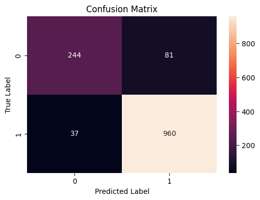

# 🎓 STUDENT PERFORMANCE FACTOR (Part 2)

## 🖥️ Machine Learning

### **📊 สิ่งที่ได้ทำมาแล้ว**
  - ✅ **Questions & Hypothesis**
  - ✅ **Data Cleansing**
  - ✅ **Exploratory Data Analysis (EDA)**
  - ✅ **Findings and Insights**
  - ✅ **Recommendation/Action and Impact**
  - ✅ **Source** https://github.com/alliedsauce/STUDENTPERFORMANCEFACTOR-DS512

---

## **🎯 SMART Objectives**

ยกระดับนักเรียนในกลุ่มคะแนนต่ำ (คะแนนสอบ < 70) จำนวน 10% ให้อยู๋ในกลุ่มคะแนนสูง (คะแนนสอบ ≥ 70) ภายในสิ้นปีการศึกษา 2568
โดยใช้ทรัพยากรที่มีอยู่ เช่น การเพิ่มการเข้าชั้นเรียนและการเข้าถึงทรัพยากรต่าง ๆ ของสถานศึกษา ซึ่งเป็นปัจจัยที่อยู่ในขอบเขตทรัพยากรที่มี

---
## **🌐 Modeling Methodology**
**📦 การแบ่งกลุ่มตาม SMART Objectives**
 1. แบ่งกลุ่มนักเรียนเป็น 2 กลุ่ม จากข้อมูล 6,607 Records
    - กลุ่มที่มีคะแนนต่ำ (คะแนนสอบ < 70) จำนวน 4,982 คน
    - กลุ่มที่มีคะแนนสูง (คะแนนสอบ ≥ 70) จำนวน 1,625 คน
 2. ใช้โมเดล Supervised Learning แบบ Classification
    - Label: กลุ่มที่มีคะแนนต่ำ และ กลุ่มที่มีคะแนนสูง
 3. โมเดลที่เลือกใช้
    - Logistic Regression

---

## **🗂️ Data Preprocessing**
 **1. 🚀 Target variables & feature**
 
 **Target: score_group**
  ```python
  df['Score_Group'] = np.where(df['Exam_Score'] >= 70,'คะแนนสูง', 'ตะแนนต่ำ')
  y = df['Score_Group']
  ```
 **Feature**
   ```python
  feature_columns = [
    'Attendance',
    'Hours_Studied',
    'Previous_Scores',
    'Tutoring_Sessions',
    'Internet_Access',
    'Motivation_Level',
    'Family_Income',
    'Extracurricular_Activities',
    'Parental_Involvement'
  ]
  X = df[feature_columns]
  ```

---

 **2. 🧮 Encoding**
  ```python
  #ลบแถวที่มีค่าว่าง (NaN) ทั้งใน X และ y
  print(f"จำนวนแถวเริ่มต้น: {len(X)}")
  X = X.dropna()
  y = y.loc[X.index]
  print(f"จำนวนแถวหลังลบค่าว่าง: {len(X)}")

  #การแปลงข้อมูลแบบลำดับ (Ordinal Encoding) สำหรับ 3 คอลัมน์
  ordinal_cols = [
    'Parental_Involvement',
    'Family_Income',
    'Motivation_Level',
  ]
  categories = [
    ['Low', 'Medium', 'High'],
    ['Low', 'Medium', 'High'],
    ['Low', 'Medium', 'High'],
  ]
  encoder = OrdinalEncoder(categories=categories)
  #แปลงคอลัมน์เหล่านี้เป็น String ก่อนเข้า encoder
  X[ordinal_cols] = encoder.fit_transform(X[ordinal_cols].astype(str))

  #การแปลงข้อมูลแบบ Binary (Yes/No)
  binary_cols = ['Internet_Access','Extracurricular_Activities']
  X[binary_cols] = X[binary_cols].replace({'Yes': 1, 'No': 0})

  #การแปลงคอลัมน์ตัวเลขให้แน่ใจว่าเป็นตัวเลข
  numeric_cols = ['Attendance', 'Hours_Studied','Previous_Scores','Tutoring_Sessions']
  for col in numeric_cols:
    X[col] = pd.to_numeric(X[col], errors='coerce')
 ```

---

 **3. ✂️ Train/Test Split**     
 ```python
from sklearn.model_selection import train_test_split
X_train, X_test, y_train, y_test = train_test_split(X, y, test_size=0.2, random_state=42, stratify=y)
print("ขนาดชุด Train:", X_train.shape)
print("ขนาดชุด Test :", X_test.shape)
```

---

**4. ⚖️ Scaling Strategies: Standard Scalar**
```python
from sklearn.preprocessing import StandardScaler
scaler = StandardScaler()
X_train_scale = scaler.fit_transform(X_train)
X_test_scale = scaler.transform(X_test)
```

---

**5. 🤖 Model: Logistic Regression**
```python
from sklearn.linear_model import LogisticRegression
logreg = LogisticRegression(max_iter=200)
logreg.fit(X_train_scale, y_train)

y_pred = logreg.predict(X_test_scale)
```

---

**6. 🔢Confusion Matrix**
```python
cm = confusion_matrix(y_test, y_pred)
plt.figure(figsize=(6,4))
sns.heatmap(cm, annot=True, fmt='d')
plt.xlabel("Predicted Label")
plt.ylabel("True Label")
plt.title("Confusion Matrix")
plt.show()
```


Label 0 (Negative Class) ⇒ กลุ่มคะแนนสูง

Label 1 (Positive Class) ⇒  กลุ่มคะแนนต่ำ

**✔️❌True Negative (TN)** = 244 (บนซ้าย)

แปลว่า: แบบจำลองระบุกลุ่มคะแนนสูง (์N) ได้ถูกต้อง

**✔️✔️True Positive (TP)** = 960 (ล่างขวา)

แปลว่า: แบบจำลองระบุกลุ่มคะแนนต่ำ (์P) ได้ถูกต้อง

**❌❌False Negative (FN)** = 37 (ล่างซ้าย)

แปลว่า: แบบจำลองระบุกลุ่มคะแนนสูง (์N) ผิดพลาด

**❌✔️False Positive (FP)** = 81 (บนขวา)

แปลว่า: แบบจำลองระบุกลุ่มคะแนนต่ำ (์P) ผิดพลาด

---

**7. 📊 Classification Report**
```python
print(classification_report(y_test, y_pred))
```

## Classification Report

|    | Precision | Recall | F1-Score | Support |
|--------------|-----------|--------|----------|---------|
| คะแนนสูง     | 0.87      | 0.75   | 0.81     | 325     |
| คะแนนต่ำ     | 0.92      | 0.96   | 0.94     | 997     |
| Accuracy     |           |        | 0.91     | 1322    |
| Macro Avg    | 0.90      | 0.86   | 0.87     | 1322    |
| Weighted Avg | 0.91      | 0.91   | 0.91     | 1322    |

Support: จำนวนตัวอย่างในแต่ละคลาส
คะแนนสูง = 325
คะแนนต่ำ = 997
รวม = 1322

Accuracy สัดส่วนของการทำนายถูกทั้งหมด
0.91 → โมเดลทำนายถูกต้อง 91% ของข้อมูลทั้งหมด

Precision
คะแนนสูง (TN) = 0.87 → ในกลุ่มที่โมเดลทำนายว่า “สูง” มี 87% ที่ถูกต้องจริง
คะแนนต่ำ (TP) = 0.92 → ในกลุ่มที่ทำนายว่า “ต่ำ” มี 92% ที่ถูกต้องจริง

Recall 
คะแนนสูง = 0.75 → โมเดลจับได้ 75% ของกลุ่มสูงจริง
คะแนนต่ำ = 0.96 → โมเดลจับได้ 96% ของกลุ่มต่ำจริง

สรุปจากตาราง
โมเดลทำงานดีมากกับ “คะแนนต่ำ” (Recall = 0.96, F1 = 0.94)
“คะแนนสูง” มี Precision ดี (0.87) แต่ Recall ต่ำกว่า (0.75) → โมเดลพลาดบางคนที่ควรอยู่ในกลุ่มสูง
Accuracy รวม = 91% ถือว่าดี


---
